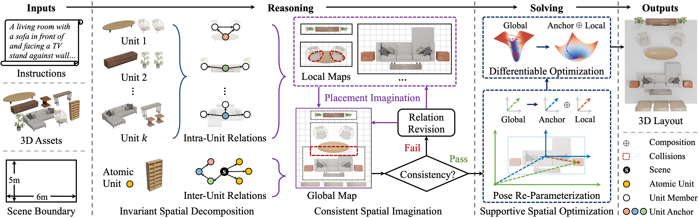

<div align="center">

<h1>R<sup>3</sup>L: Reasoning 3D Layouts from Relative Spatial Relations</h1>

<p>
  <a href="https://arxiv.org/pdf/2605.06758"></a>
  <a href="https://icml.cc/virtual/2026/poster/64583"></a>
  <a href="./LICENSE"></a>
</p>

<p>
  <strong>Zhifeng Gu<sup>*</sup></strong>&nbsp;&nbsp;
  <strong>Yuqi Wang<sup>*</sup></strong>&nbsp;&nbsp;
  <strong>Bing Wang</strong>
</p>

<p>
  Spatial Intelligence Group, The Hong Kong Polytechnic University
</p>

</div>

<br>
<p align="center">
  
</p>


---

## Get Started

Tested on macOS and Ubuntu. The Blender renderer auto-routes to **METAL** (macOS) or **CUDA** (Ubuntu).

**Prerequisites:** Python 3.10 (enforced by `uv`). Install `uv` if you haven't:

```bash
curl -LsSf https://astral.sh/uv/install.sh | sh
```

**1. Sync dependencies and fetch data & retriever models:**

```bash
uv sync
uv run python scripts/download_data.py    # objathor asset data
uv run python scripts/download_models.py  # retriever models
```

**2. Set your API keys:**

```bash
cp scripts/env.example.sh scripts/env.sh
vim scripts/env.sh
```

**3. Run:**

```bash
source scripts/env.sh
uv run -q python main.py
```

If you run into any trouble, please [file an issue](https://github.com/Neal2020GitHub/R3L/issues).

## Acknowledgements

This project builds upon [Holodeck](https://github.com/allenai/Holodeck) and [LayoutVLM](https://github.com/sunfanyunn/LayoutVLM). We sincerely thank the authors for their open-source contributions.

## Citation

```bibtex
@inproceedings{gu2026r3l,
  title     = {R$^3$L: Reasoning 3D Layouts from Relative Spatial Relations},
  author    = {Gu, Zhifeng and Wang, Yuqi and Wang, Bing},
  booktitle = {International Conference on Machine Learning (ICML)},
  year      = {2026},
  url       = {https://arxiv.org/abs/2605.06758}
}
```

## License

This project is licensed under the [MIT License](./LICENSE). Vendored third-party components (under `planners/holodeck_v2/`, `retrievers/holodeck_v2/`, `utils/third_party/`) retain their own licenses.