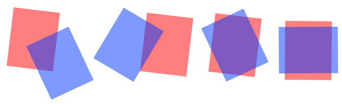

# Rotated IoU



Image source: [Stack Overflow](https://stackoverflow.com/questions/11670028/area-of-intersection-of-two-rotated-rectangles), as cited by the upstream project.

This vendored package provides differentiable IoU, GIoU, and DIoU utilities for oriented 2D boxes and z-axis-aligned 3D boxes. R3L uses it for collision and overlap losses in layout optimization.

## Why This Copy Exists

The upstream project, [`lilanxiao/Rotated_IoU`](https://github.com/lilanxiao/Rotated_IoU), implements differentiable rotated-box IoU and originally used a compiled CUDA/C++ extension for one operation: sorting the vertices of the intersection polygon.

That CUDA extension made reproduction fragile because users needed a compatible CUDA toolkit, PyTorch CUDA build, compiler, and extension build environment. For R3L, we vendor the MIT-licensed implementation and replace the compiled extension path with a vectorized pure PyTorch implementation. No local CUDA/C++ build step is required.

## Module Layout

- `losses.py` - public loss APIs such as `cal_iou`, `cal_my_iou`, `cal_giou`, `cal_my_giou`, and their 3D variants.
- `intersection.py` - oriented 2D box intersection geometry and polygon-area calculation.
- `vertex_sort.py` - vectorized PyTorch sorting for intersection polygon vertices; this replaces the original compiled CUDA extension.
- `enclosing_box.py` - enclosing-box helpers used by GIoU and DIoU.
- `__init__.py` - canonical exports plus legacy compatibility aliases.

Legacy aliases such as `oriented_iou_loss`, `box_intersection_2d`, and `min_enclosing_box` remain exposed from `__init__.py` so older R3L imports keep working. New code should prefer the canonical module names above.

## Changes From Upstream

Compared with the original third-party implementation, this vendored copy:

- removes the `cuda_op/` directory and all CUDA/C++ build files;
- replaces the compiled `sort_vertices` extension with `vertex_sort.py`;
- keeps the original containment tolerance used by the reference implementation;
- preserves reference behavior for duplicate-corner edge cases;
- reorganizes module names by responsibility;
- adds R3L regression coverage against values generated from the compiled upstream CUDA extension.

## Performance

The pure PyTorch replacement isn't just for portability fallback. After vectorizing the vertex-sort step, it seems to be comparable to the original compiled CUDA extension on our benchmark machine.

Benchmark environment: NVIDIA GeForce RTX 4090, PyTorch 2.7.1+cu118, CUDA runtime 11.8. Times below are median wall-clock milliseconds with CUDA synchronization. Lower is better.

| Operation | Shape | Pure PyTorch | Original CUDA extension | Ratio |
|---|---:|---:|---:|---:|
| `sort_indices` | `B=1, N=256` | 0.278 ms | 0.156 ms | 1.79x slower |
| `sort_indices` | `B=1, N=1024` | 0.279 ms | 0.470 ms | 1.68x faster |
| `sort_indices` | `B=4, N=1024` | 0.279 ms | 0.451 ms | 1.62x faster |
| `sort_indices` | `B=8, N=2048` | 0.297 ms | 0.860 ms | 2.90x faster |
| `cal_iou` | `B=1, N=256` | 0.974 ms | 0.743 ms | 1.31x slower |
| `cal_iou` | `B=1, N=1024` | 0.974 ms | 1.032 ms | 1.06x faster |
| `cal_iou` | `B=4, N=1024` | 0.973 ms | 1.051 ms | 1.08x faster |
| `cal_iou` | `B=8, N=2048` | 0.988 ms | 1.454 ms | 1.47x faster |

These numbers are meant as an implementation sanity check, not a hardware-independent guarantee. The main takeaway is that the PyTorch path removes local CUDA/C++ compilation without giving up CUDA-extension-level runtime performance for the R3L workloads we tested.

## License And Attribution

This package is derived from [`lilanxiao/Rotated_IoU`](https://github.com/lilanxiao/Rotated_IoU), Copyright (c) 2020 Lanxiao Li, licensed under the MIT License.

The full upstream MIT license text is preserved in `LICENSE`. Keep that file with any redistribution of this vendored package.

The upstream implementation is an unofficial implementation inspired by the paper:

```bibtex
@INPROCEEDINGS{8886046,
  author={D. {Zhou} and J. {Fang} and X. {Song} and C. {Guan} and J. {Yin} and Y. {Dai} and R. {Yang}},
  booktitle={2019 International Conference on 3D Vision (3DV)},
  title={IoU Loss for 2D/3D Object Detection},
  year={2019},
  pages={85-94},
}
```
